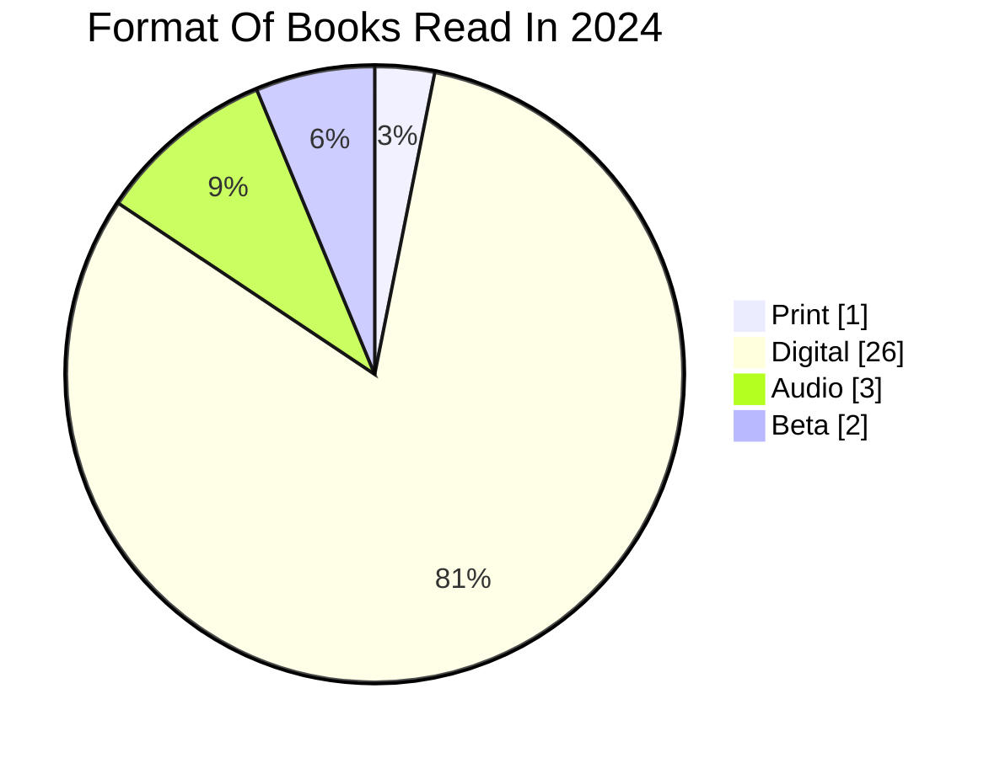

Scenario: A student wants to set aside some funds to later invest in a personal library. Books come in various formats to accomodate reader habits and means. They already own a few physical copies of books they want to read, a friend offers to loan them an ereader for a few months so they have access to digital books, and they can find audio books on their phone. There are also a few manuscript drafts they have agreed to beta read for their friends sent via file sharing, so they count those as well. If they keep track of their reading habits, it will give them more insight into what would be the best option to invest in at the end of the year.  

Whether they should invest in print, digital, audio, or file sharing methods for their reading has become clear. Digital format books were the majority of how they read books throughout the year. The student should spend their saved money on their own ereader for the future.
